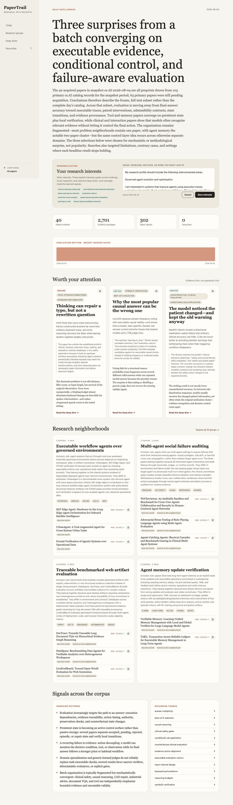
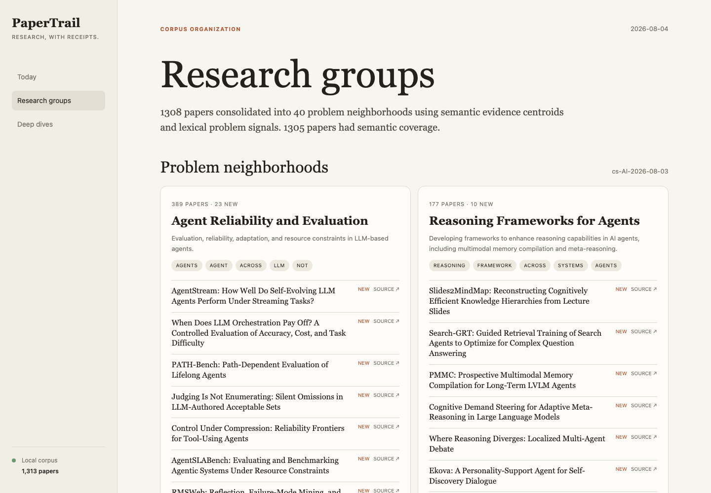
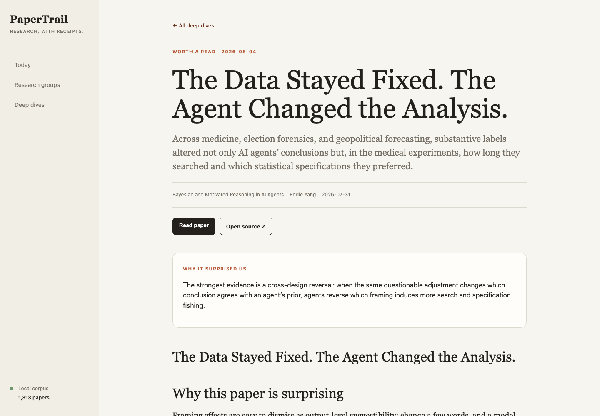
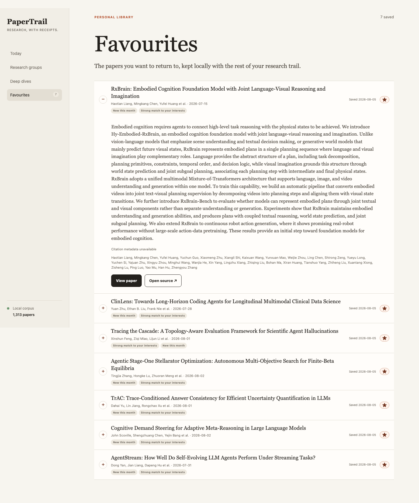

# PaperTrail

**A local research intelligence library for Codex, Claude, and humans.**

PaperTrail ingests papers, preserves their exact evidence and figures, builds a hybrid
search index, groups related work, and gives research agents a read-only MCP interface.
It is designed to help an agent compare papers, challenge an idea against prior work,
and propose falsifiable research directions—not merely summarize PDFs.

It runs as one lightweight Python package with SQLite and local files. Use Ollama to keep model calls
on your machine, or bring OpenAI reasoning and embedding models with your own API key.

## Watch the 2½-minute walkthrough

[](docs/demo/papertrail-demo.mp4)

Click the preview to watch the full 1080p demo—from first-time setup and the daily
paper funnel through research neighborhoods, local PDF reading, favourites, and a real
Codex investigation over PaperTrail's read-only MCP tools. Prefer text? Read the
[accessible transcript](docs/demo/transcript.md).

## See it in action

The dashboard is included with the package and listens on localhost only.



### Research neighborhoods



### Evidence-grounded deep dives



### A compact personal library




The deep-dive view links to the canonical public source and opens the indexed PDF in an
embedded reader. Generated articles can include verified figures from the paper.

Stars in paper lists and deep dives save papers to the dashboard's Favourites view. The
library is stored in the same local SQLite database, survives restarts and daily runs,
and remains user-controlled—the read-only MCP server cannot change it.

An editable free-text interest card, favourites, and, with explicit consent, local Codex or
Claude research chats personalize current rankings, future ingestion, and deep-dive selection.
PaperTrail stores normalized research-interest
signals and opaque session hashes—not copies of conversations. It retains metadata and
abstracts for the complete configured paper surplus, then directs expensive PDF and model
enrichment toward a 60/20/20 mix of preference-aligned, frontier, and exploratory work.
With two or more daily deep dives, an exploration slot remains mandatory to avoid a
relevance echo chamber.

## What it does

- Imports one PDF, one arXiv paper, or a date-bounded arXiv corpus.
- Indexes section- and page-aware evidence with SQLite FTS5 and semantic embeddings.
- Extracts contributions, methods, assumptions, results, limitations, and future work,
  each tied to exact evidence IDs.
- Captures figure captions and immutable page renders for visual inspection.
- Fuses lexical and semantic retrieval and challenges ideas against nearest prior work.
- Builds high-recall hybrid candidate neighborhoods, then uses the configured reasoning
  model to remove topical false positives and form precise shared-problem groups.
- Lets you star papers into a persistent local Favourites library.
- Accepts an explicit natural-language research profile in the dashboard or from a text/Markdown
  file during setup, and immediately re-ranks existing research groups after edits.
- Automatically learns durable research interests from consented local Codex and Claude
  histories and provides inspect, disable, forget, and rebuild controls.
- Fetches and caches Semantic Scholar citation metadata automatically, then combines
  age-normalized impact with LLM- and embedding-based personal relevance, neighborhood fit,
  and recency.
- Exposes fourteen read-only MCP tools plus a `papertrail-deep-research` Agent Skill.
- Produces daily trends and 1–3 source-linked deep-dive essays when configured with an
  analyst CLI.

## Quick start with Ollama

Requirements: Python 3.10+, SQLite FTS5, and [Ollama](https://ollama.com/).

```bash
git clone https://github.com/spraphul/papertrail.git
cd papertrail

python3 -m venv .venv
source .venv/bin/activate
python3 -m pip install -e '.[pdf,scale]'

ollama pull embeddinggemma
ollama pull qwen2.5:7b
```

Start Ollama in another terminal, then initialize PaperTrail:

```bash
ollama serve
```

```bash
export PAPERTRAIL_HOME="$HOME/.papertrail"
papertrail init
papertrail doctor
```

`sqlite-vec` is optional. If the active Python build cannot load SQLite extensions,
PaperTrail reports `python-cosine:fallback` and continues with exact in-process vector
scoring.

## Use OpenAI models

PaperTrail uses the OpenAI Responses API for evidence extraction and research reasoning,
and the Embeddings API for batched vectors. Set either or both provider roles to
`openai`; mixed setups such as local embeddings with OpenAI reasoning are supported.

```bash
export OPENAI_API_KEY="<your-api-key>"
export PAPERTRAIL_EMBEDDING_PROVIDER=openai
export PAPERTRAIL_REASONING_PROVIDER=openai
export PAPERTRAIL_EMBEDDING_MODEL=text-embedding-3-small
export PAPERTRAIL_REASONING_MODEL=gpt-5.6

papertrail init
papertrail doctor
papertrail add-arxiv 2501.01234
papertrail enrich
```

Model IDs are configuration, not a hard-coded allowlist. You can use any model available
to your account that supports the required endpoint: an embedding model for
`PAPERTRAIL_EMBEDDING_MODEL`, and a Responses API model with Structured Outputs for
`PAPERTRAIL_REASONING_MODEL`.

For a mixed local/cloud setup:

```bash
export PAPERTRAIL_EMBEDDING_PROVIDER=ollama
export PAPERTRAIL_EMBEDDING_MODEL=embeddinggemma
export PAPERTRAIL_REASONING_PROVIDER=openai
export PAPERTRAIL_REASONING_MODEL=gpt-5.6
```

`OPENAI_BASE_URL` can point to an OpenAI-compatible `/v1` endpoint. Compatibility depends
on that service implementing batched `/embeddings` and Responses Structured Outputs.
API keys are read from the environment and are never copied into PaperTrail's profile or
database.

### Add your first paper

From arXiv:

```bash
papertrail add-arxiv 2501.01234
papertrail enrich
papertrail snapshot create my-library
```

Or from a local PDF:

```bash
papertrail add-pdf ./paper.pdf \
  --title "Paper title" \
  --authors "First Author, Second Author" \
  --published 2026-07-15 \
  --source-url https://example.org/paper
```

PaperTrail stores source files by content hash and never invents model output when a
provider is unavailable. A published snapshot freezes paper versions, embeddings, and
scientific records together.

### Open the dashboard

```bash
papertrail serve
```

Visit [http://127.0.0.1:8765](http://127.0.0.1:8765).

## Connect Codex or Claude

One command installs the bundled research skill and adds the local stdio MCP server to
the selected client:

```bash
papertrail connect codex --scope user
papertrail connect claude --scope user
```

Use `--scope project` for repository-local configuration. Restart the client after
connecting, then try:

```text
Use $papertrail-deep-research to investigate agent adaptation to changing tool
interfaces. Search broadly, inspect exact evidence and diagrams, challenge the idea
against prior work, and cite evidence IDs.
```

The skill drives a retrieval-first workflow: broad catalog search, exact evidence,
structured scientific records, figure inspection, counterevidence, and a corpus-bounded
novelty check. The MCP server is read-only.

## Ingest a corpus end to end

This single resumable command discovers metadata, downloads PDFs, parses full text,
indexes figures, embeds evidence passages, and extracts scientific records:

```bash
papertrail arxiv ingest \
  --category cs.AI \
  --from-date 2026-07-01 \
  --to-date 2026-07-31 \
  --primary-only \
  --all \
  --workers 8 \
  --enrichment full
```

Acquisition is sequential and observes arXiv's three-second request interval. Local
parse and render work is bounded by `--workers`. The command is resumable, deduplicates
paper versions by content hash, and stops before free disk falls below 5 GB by default.
Use `--limit N` instead of `--all` for a trial run.

For lower-cost ingestion, choose `--enrichment embeddings` or `--enrichment none`, then
resume enrichment later:

```bash
papertrail enrich --from-date 2026-07-01 --to-date 2026-07-31
```

Create and organize a reproducible snapshot:

```bash
papertrail snapshot create cs-ai-2026-07 \
  --from-date 2026-07-01 \
  --to-date 2026-07-31 \
  --category cs.AI \
  --primary-only

papertrail organize --snapshot cs-ai-2026-07
```

Research groups are navigation aids, not scientific claims. With embeddings available,
membership combines semantic evidence centroids with lexical problem signals.

## Search and discovery

```bash
# Exact lexical evidence
papertrail search "agent recovery after tool failure" --snapshot cs-ai-2026-07

# Lexical + semantic retrieval
papertrail hybrid-search \
  "performance degradation after an unseen tool schema change" \
  --snapshot cs-ai-2026-07

# Challenge an idea against nearest indexed work
papertrail novelty \
  "Train agents on versioned tool-interface drift" \
  --snapshot cs-ai-2026-07

# Generate and challenge falsifiable opportunities
papertrail discover "long-horizon agent reliability" \
  --snapshot cs-ai-2026-07 \
  --limit 3
```

Discovery results are explicitly labeled `system_synthesis`. PaperTrail does not claim
global novelty from a local corpus.

## Daily research workflow

One setup command configures model providers, daily incremental `cs.AI` ingestion,
Codex or Claude analysis, the dashboard, and a macOS launchd schedule:

```bash
papertrail --home "$HOME/.papertrail" setup \
  --learn-from codex \
  --learn-from claude \
  --interests-file ./research-interests.md
```

Use `--interests "natural-language interests"` instead of a file when convenient. The exact
text remains editable in the dashboard. Explicit dashboard/setup interests have the highest
profile authority; favourites and consented implicit signals continue to refine them.

The consent flags are recorded once. After that, every scheduled daily run automatically
processes only new or changed local sessions before discovering papers. In an interactive
terminal, setup can ask for the same consent. Existing installations and non-interactive
setup remain opted out unless `--learn-from` is supplied.

Preference extraction uses the configured reasoning provider. With Ollama, redacted turns
remain on the machine; with OpenAI or another remote-compatible endpoint, the bounded,
redacted user turns are sent to that provider for extraction. Raw conversations are never
copied into PaperTrail's profile or database.

Useful controls include `--daily-at 06:00`, `--lookback-days 3`,
`--rolling-window-days 365`, `--analyst codex|claude`, `--daily-blogs 1|2|3`, repeated
`--client codex|claude`, `--embedding-provider ollama|openai`,
`--reasoning-provider ollama|openai`, model IDs, `--dashboard-port 8765`, and
`--daily-enrichment-budget 40`, `--interests`, `--interests-file`,
`--no-personalized-ingestion`, and `--no-schedule`.
Set the enrichment budget to `0` to fully acquire every discovered daily paper.

Citation enrichment uses Semantic Scholar's public Academic Graph API with local caching and
does not block ingestion when the service is unavailable. For steadier limits, optionally set
`SEMANTIC_SCHOLAR_API_KEY`; PaperTrail never stores the key in its database or profile.

Before the PDF cap is applied, the reasoning model scores bounded title-and-abstract batches
against the unified profile at the level of problems, mechanisms, assumptions, and evaluation
style. The deterministic ranker blends that result with embeddings, recency, and citation impact.
After full enrichment, LLM-extracted contributions, methods, results, and limitations also feed
research-neighborhood organization and relevance. Model failure falls back to semantic/lexical
ranking without stopping the daily run.

The selected analyst CLI must already be installed and authenticated. Ollama must be
running when selected. For an environment-only OpenAI key, add `--no-schedule`:

```bash
papertrail --home "$HOME/.papertrail" setup \
  --embedding-provider openai \
  --embedding-model text-embedding-3-small \
  --reasoning-provider openai \
  --reasoning-model gpt-5.6 \
  --no-schedule
```

For unattended macOS runs, put only the key in a private file such as
`$HOME/.config/papertrail/openai-key`, run `chmod 600` on it, and pass
`--openai-api-key-file` to setup. The profile stores the file path, never the key.

Run the configured workflow immediately with:

```bash
papertrail --home "$HOME/.papertrail" daily
```

To deliberately rebuild one publication day—including an incomplete current day—use:

```bash
papertrail --home "$HOME/.papertrail" daily --date 2026-08-04
```

Inspect or reset what PaperTrail has learned without exposing conversation text:

```bash
papertrail --home "$HOME/.papertrail" preferences inspect
papertrail --home "$HOME/.papertrail" preferences sources
papertrail --home "$HOME/.papertrail" preferences disable claude
papertrail --home "$HOME/.papertrail" preferences forget codex
papertrail --home "$HOME/.papertrail" preferences rebuild
```

Disabling a source stops future scans but retains its derived signals. Forgetting removes
its consent, session hashes, and derived signals. Personalized ingestion activates only
after the profile reaches a confidence threshold; until then, daily selection stays broad.

### How research neighborhoods are formed

Clustering is deliberately hierarchical:

1. Embedding and lexical similarity create broad candidate neighborhoods with high recall.
2. For every multi-paper candidate, the reasoning model receives compact paper dossiers:
   title, abstract, and typed contribution, method, assumption, empirical-result,
   limitation, and future-work records when available.
3. The model must partition every paper exactly once around a concrete shared research
   problem. A shared broad topic or model family is not sufficient, and uncertain papers
   become singletons instead of being forced into a misleading bucket.

Candidate groups are adjudicated in bounded batches of 20 papers. Malformed, incomplete,
or unavailable model output never drops papers; PaperTrail retains the corresponding
hybrid candidate group and reports the fallback count in `llm_refinement` metadata.

## How PaperTrail is built

```text
PDFs / arXiv
     │
     ▼
immutable artifacts ──► pages, passages, captions, scientific records
                              │
                              ▼
                   SQLite FTS5 + vector index
                              │
                   hybrid candidates + LLM adjudication
                              │
                 ┌────────────┴────────────┐
                 ▼                         ▼
        read-only MCP + skill       dashboard + daily blogs
                 │
                 ▼
            Codex / Claude

local Codex / Claude chats ──► redacted interest signals ──► enrichment priority
                                  ▲
                              favourites
```

The default installation has no database service, queue, object store, or container.
The corpus lives under `PAPERTRAIL_HOME`:

```text
.papertrail/
  profile.json
  papertrail.db
  runtime/
  artifacts/
    papers/<sha256-prefix>/<sha256>.pdf
```

Only sources and categories the user explicitly imports or configures are indexed. Corpus
files, credentials, generated client configuration, and local research outputs are ignored
by Git.

## Command map

| Goal | Command |
|---|---|
| Check local capabilities | `papertrail doctor` |
| Add one arXiv paper | `papertrail add-arxiv ARXIV_ID` |
| Add a local PDF | `papertrail add-pdf PATH --title TITLE` |
| Build a corpus | `papertrail arxiv ingest ...` |
| Resume enrichment | `papertrail enrich ...` |
| Search evidence | `papertrail search QUERY` |
| Search figures | `papertrail search-figures QUERY` |
| Create a snapshot | `papertrail snapshot create ID` |
| Organize a snapshot | `papertrail organize --snapshot ID` |
| Inspect learned interests | `papertrail preferences inspect` |
| Control chat learning | `papertrail preferences enable|disable|forget SOURCE` |
| Run the daily adaptive workflow | `papertrail daily` |
| Start the dashboard/API | `papertrail serve` |
| Start MCP over stdio | `papertrail mcp` |
| Connect an agent | `papertrail connect codex|claude` |

## Development

```bash
python3 -m pip install -e '.[dev,pdf,scale]'
make test
./script/build_and_run.sh --verify
```

Development and production use the same provider boundary: fully local Ollama or a
bring-your-own OpenAI-compatible endpoint and model IDs.

The implementation is one ordinary Python package with no required runtime
dependencies. Detailed component and trust boundaries are in
[docs/ARCHITECTURE.md](docs/ARCHITECTURE.md); release criteria are in
[docs/EVALUATION.md](docs/EVALUATION.md).

## Current boundaries

- PDF section recovery is best effort. `pypdf` preserves page boundaries; Ghostscript
  is used for immutable page renders when installed.
- Vector search uses optional `sqlite-vec` or an exact Python cosine fallback.
- Local model quality affects extraction and discovery quality; provenance validation
  prevents broken references but does not prove scientific correctness.
- Native daily scheduling currently targets macOS launchd.
- arXiv coverage is not equivalent to the peer-reviewed or global literature.

Apache-2.0 licensed. See [LICENSE](LICENSE).
